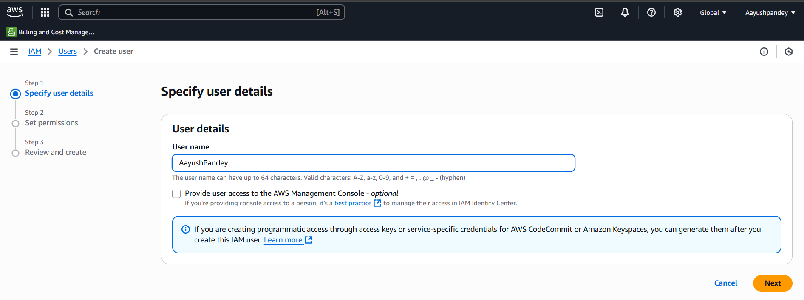

# Step-by-Step AWS Static Site Deployment

## 1. 🛠 Create an IAM User in AWS
- Go to the [AWS IAM Console](https://console.aws.amazon.com/iam/)
- Create a user with **AWS S3 Full Access**
- Attach the following policy to the user



---

## 2. ✅ Create an S3 Bucket
- Go to the [AWS S3 Console](https://s3.console.aws.amazon.com/)
- Click **Create bucket**
- Provide:
  - **Bucket name:** your-unique-bucket-name
  - **Region:** Asia Pacific (Mumbai) (`ap-south-1`)
- Leave other settings as default and click **Create bucket**


---

## 3. 🌐 Enable Static Website Hosting
- Open your bucket and go to the **Properties** tab
- Scroll to **Static website hosting** > Click **Edit**
- Enable **Static website hosting**
- Set:
  - **Index document:** `index.html`
  - **Error document:** `index.html` (or `error.html`)
- Click **Save changes**


---

## 4. 🔓 Allow Public Access
- In the bucket, go to the **Permissions** tab
- Under **Block public access (bucket settings)**, click **Edit**
- Uncheck all options (especially “Block all public access”)
- Confirm by checking the warning box
- Click **Save changes**


---

## 5. 👥 Set Object Ownership to Public
- Still under **Permissions**, scroll to **Object Ownership** and click **Edit**
- Choose:
  - **ACLs enabled**
  - **Bucket owner preferred**
- Click **Save changes**


---

## 6. 🛡 Attach Public Read Policy (AWS Policy Generator)
- Open the [AWS Policy Generator](https://awspolicygen.s3.amazonaws.com/policygen.html)
- Configure:
  - **Effect:** Allow
  - **Principal:** `*`
  - **Action:** `s3:GetObject` (or select **All Actions**)
  - **ARN:** `arn:aws:s3:::your-unique-bucket-name/*`
- Generate the policy and attach it to your bucket


---

## 7. 🔑 Create Access Keys for IAM User
- In the IAM console, select your user
- Go to **Security credentials** > **Create access key**
- Note down the **Access Key ID** and **Secret Access Key**


---

## 8. ⚙️ Set Up GitHub Actions Workflow
1. In your GitHub repository, click the **Actions** tab  
2. Choose **Set up a workflow yourself** or **New workflow**  
3. Create a file at `.github/workflows/main.yml` and paste:

```yaml
name: production testing pipeline

on:
  push:
    branches: [main]

jobs:
  deploy:
    name: Build, Test & Deploy Portfolio
    runs-on: ubuntu-latest

    steps:
      - name: Checkout code
        uses: actions/checkout@v3

      - name: Validate Files Exist
        run: |
          test -f DevOps-Project/Dummy-portfolio-code/index.html || (echo "index.html missing" && exit 1)
          test -f DevOps-Project/Dummy-portfolio-code/style.css || (echo "style.css missing" && exit 1)
          test -f DevOps-Project/Dummy-portfolio-code/script.js || (echo "script.js missing" && exit 1)

      - name: Configure AWS Credentials
        uses: aws-actions/configure-aws-credentials@v2
        with:
          aws-access-key-id: ${{ secrets.AWS_ACCESS_KEY_ID }}
          aws-secret-access-key: ${{ secrets.AWS_SECRET_ACCESS_KEY }}
          aws-region: 'ap-south-1'

      - name: Deploy to S3
        run: |
          aws s3 sync DevOps-Project/Dummy-portfolio-code/ s3://${{ secrets.AWS_S3_BUCKET_NAME }} --delete
```

---

## 9. 🔐 Add Repository Secrets
- Go to **Settings > Secrets and variables > Actions**  
- Click **New repository secret**  
- Add the following secrets:
  - `AWS_ACCESS_KEY_ID`
  - `AWS_SECRET_ACCESS_KEY`
  - `AWS_S3_BUCKET_NAME`
